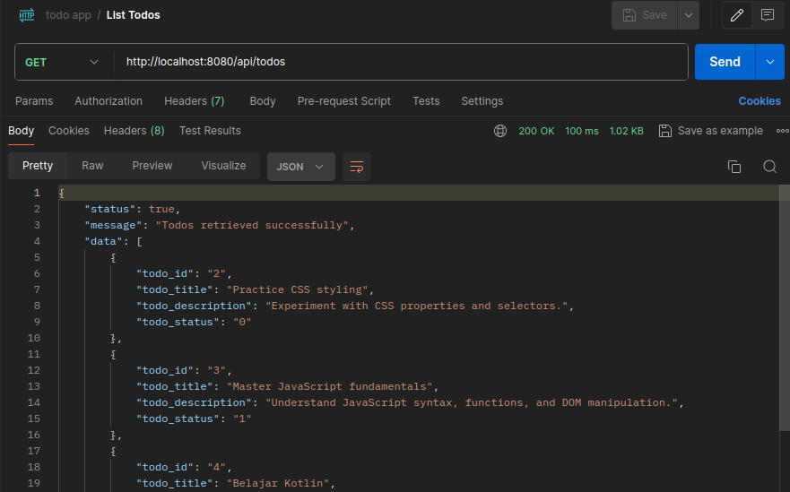
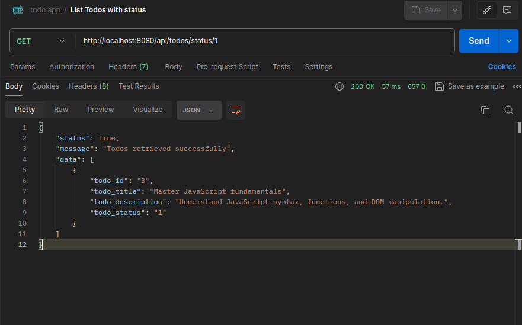
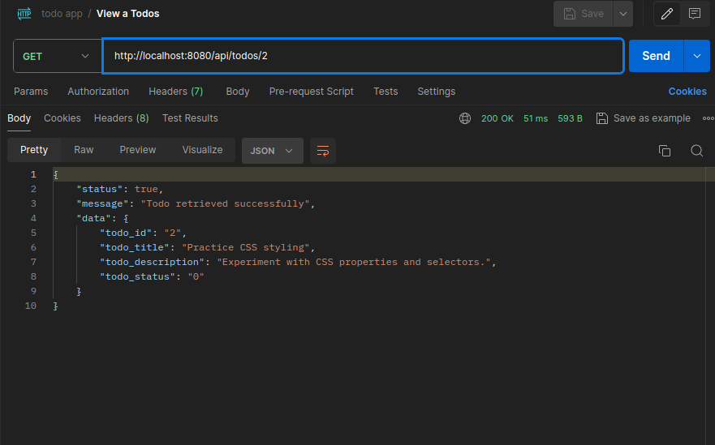
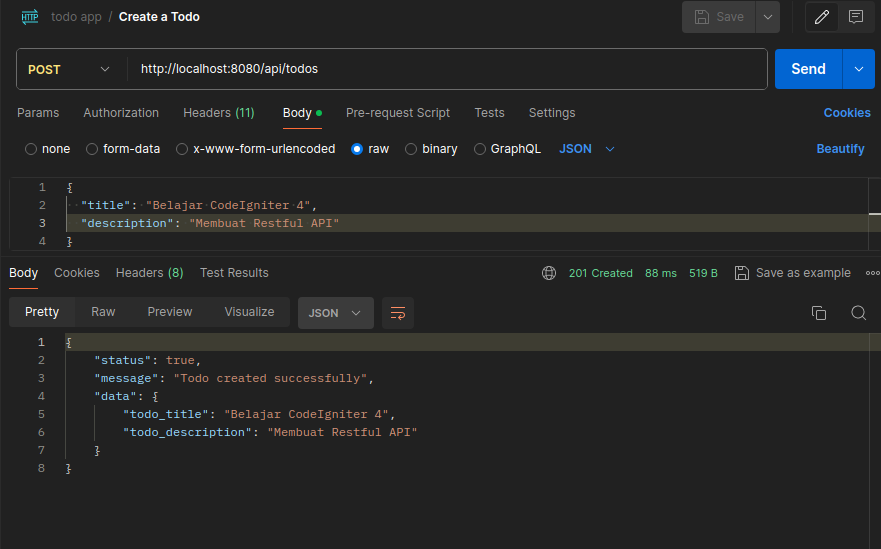
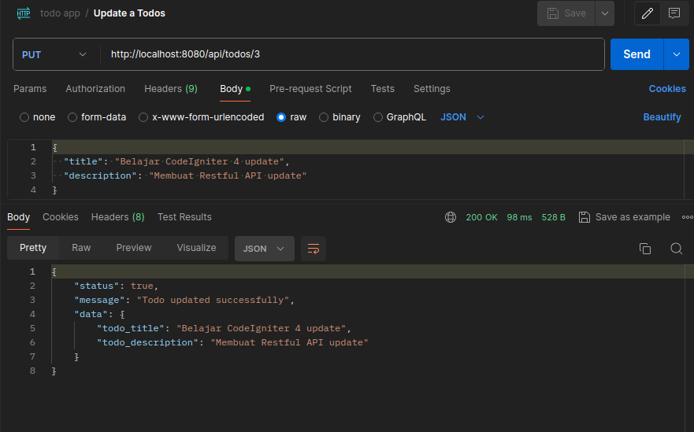
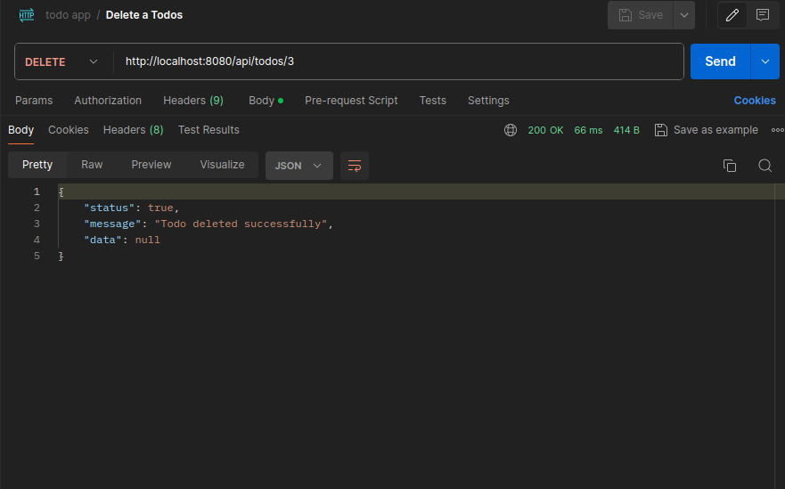

## API Aplikasi Todo

Desain aplikasi android: 
https://www.figma.com/file/Lnv6GdopZayd36rxf2uBrF/Todo-App?type=design&node-id=108%3A42&mode=design&t=vDCjqmKqlDvczt0u-1

## API Endpoints

| Method | Endpoint                   | Deskripsi                                    |
| ------ | -------------------------- | -------------------------------------------- |
| GET    | /api/todos                 | Mendapatkan daftar semua todos.              |
| GET    | /api/todos/status/{status} | Mendapatkan daftar todos berdasarkan status. |
| GET    | /api/todos/{id}            | Mendapatkan detail todo berdasarkan ID.      |
| POST   | /api/todos                 | Membuat todo baru.                           |
| PUT    | /api/todos/{id}            | Mengupdate data todo.                        |
| DELETE | /api/todos/{id}            | Menghapus todo berdasarkan ID.               |

## Test dengan Postman

GET `http://localhost:8080/api/todos` 
Menampilkan semua data todo baik yang sudah selesai maupun belum

GET `http://localhost:8080/api/todos/status/1` 
Menampilkan data todo berdasarkan status 0 = belum selesai, 1 = sudah selesai

GET `http://localhost:8080/api/todos/2` 
Menampilkan data detail todo berdasarkan ID

POST `http://localhost:8080/api/todos` 
Membuat data todo baru

PUT `http://localhost:8080/api/todos/3` 
Mengupdate data todo berdasarkan ID

DELETE `http://localhost:8080/api/todos/3` 
Menghapus data todo berdasarkan ID

